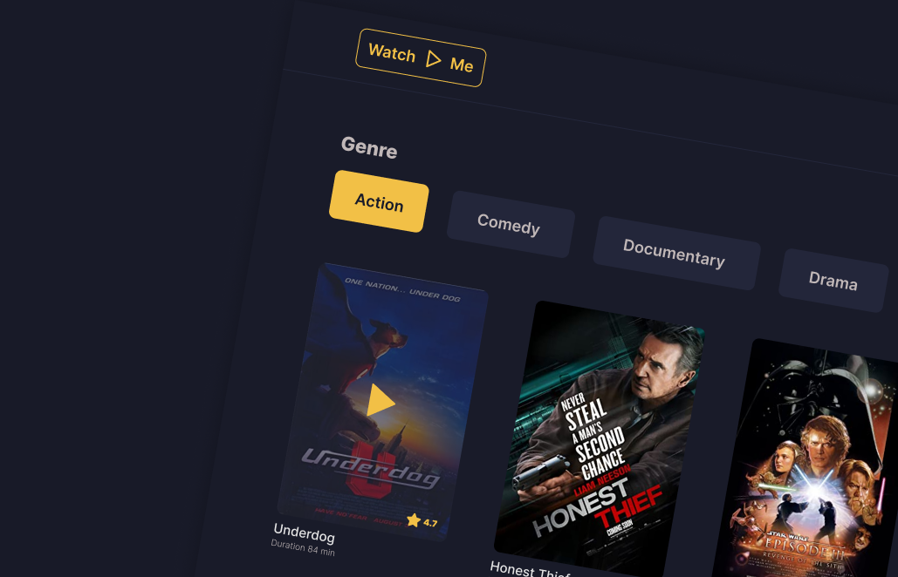

  <h1>Watch Me</h1>
  
A redesign of the Rocketseat Watch Me project in React.js, Vue.js, Svelte and Angular

## What was built

Watch Me is a simple application that lists movies by genre. the application was built on 4 frontend frameworks

## Running Application

- **API** - For running API Server, [click here](api-json-server/README.md)
- **React App** - For running React App, [click here](watch-me-react/README.md)

## Assets

- UI - Figma ([click here](https://www.figma.com/file/un8ZJsPoatiOmFsZF6Xnvb/WatchMe?node-id=0%3A1))
